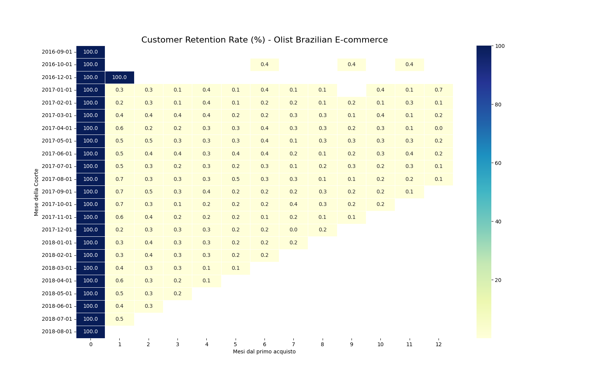
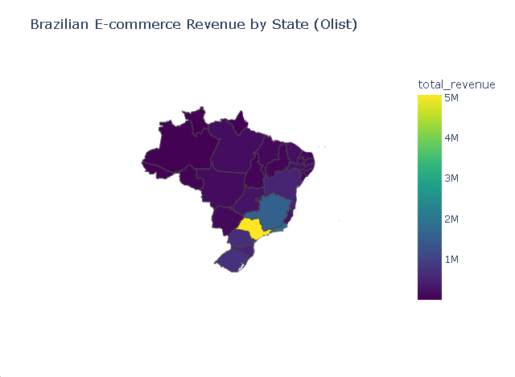
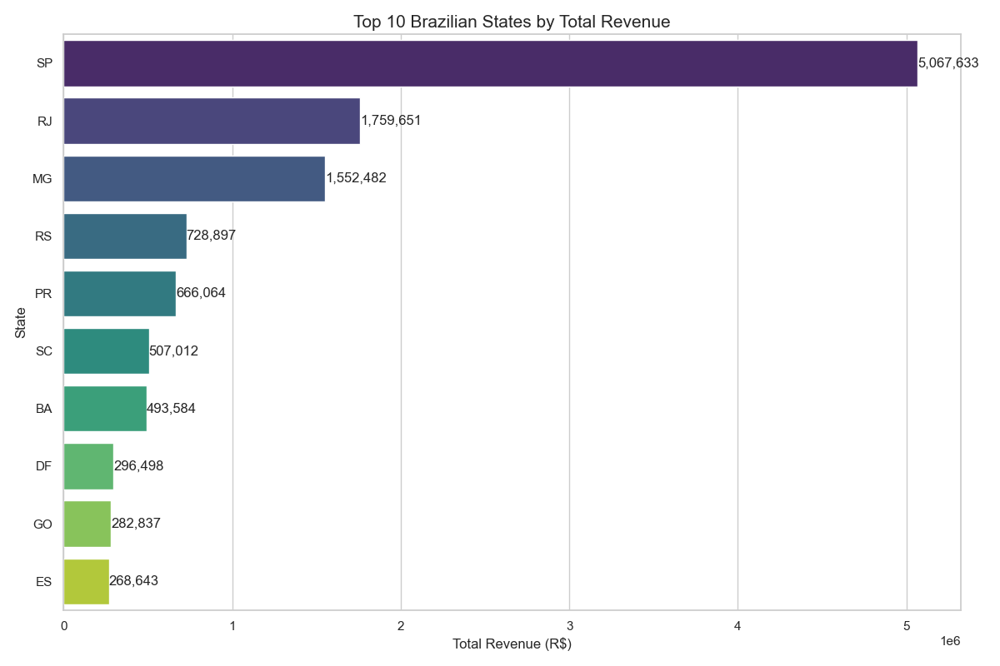
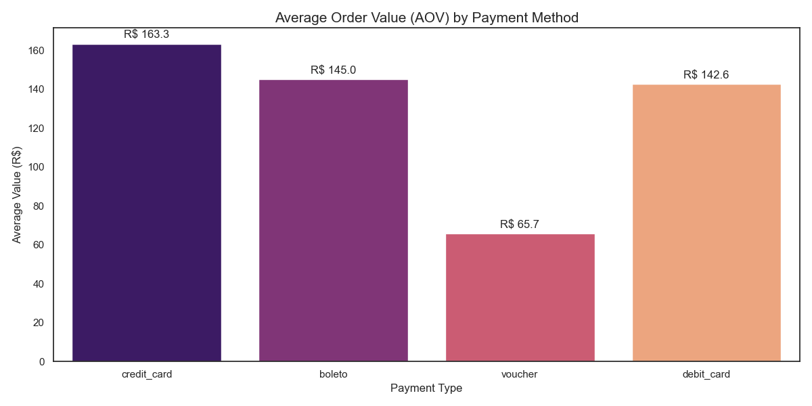

# 📊 E-Commerce Analytics: Customer Retention & Geospatial Insights
**Data Analyst Portfolio Project | Dataset: Olist Brazilian E-Commerce**

## 🎯 Project Overview
This project analyzes business health and customer behavior for a major Brazilian marketplace. Using **SQL (BigQuery)** for data extraction and **Python** for advanced analytics, I transformed over 100k transactional records into actionable insights regarding customer loyalty and regional sales performance.

## 🛠️ Tech Stack
* **Cloud Data Warehouse:** Google BigQuery
* **Languages:** SQL (Standard SQL), Python 3.9
* **Libraries:** Pandas, Seaborn, Plotly, Matplotlib
* **IDE:** PyCharm

---

## 📈 Analysis 1: Monthly Cohort Retention
I developed a SQL pipeline to group customers into cohorts based on their first purchase month, tracking their return rate over a 12-month lifecycle.

### Key Insights:
* **Retention Floor:** The analysis shows a retention rate below 5% from Month 1 onwards, indicating a business model heavily reliant on new customer acquisition.
* **Churn Patterns:** Identifying these patterns allows for targeted CRM and loyalty marketing interventions.

---

## 🌎 Analysis 2: Geospatial Spending & Revenue
In this section, I explored the geographic distribution of revenue (GMV) across Brazil to identify high-value regions and market concentration.

### Key Insights:
* **Market Concentration:** The Southeast region, particularly **São Paulo (SP)**, accounts for over 40% of total revenue.
* **Regional Performance:** Top-performing states include SP, RJ (Rio de Janeiro), and MG (Minas Gerais), which drive the majority of sales volume.
* **AOV Analysis:** While some northern states have fewer orders, they occasionally show a higher Average Order Value (AOV).

### Visualizations:
* **Revenue Map:** An interactive visualization showing revenue density by state.
* **Top States Chart:** A ranking of the top 10 states by total gross revenue.

---

## 💳 Analysis 3: Payment Methods & Financial Impact
I analyzed how different payment methods influence the Average Order Value (AOV).

### Key Insights:
* **Credit Card Supremacy:** Credit cards are the most used method and drive the highest AOV (R$ 163), likely due to the "installments" (rateizzazione) feature.
* **Boleto usage:** A significant portion of transactions uses Boleto, which typically has a lower AOV (R$ 145).
* **Installment Strategy:** On average, credit card purchases are split into 3-5 installments, which is a key driver for higher-priced items in the Brazilian market.

---

## 🛡️ Data Quality & Professional Approach
Following professional data standards, this project includes:
* **Logical Validations:** SQL checks for shipping vs. delivery date anomalies.
* **Clean Code:** Structured Python scripts for reproducibility.
* **Dependencies:** Managed via `requirements.txt`.

## 📂 Repository Structure
* `sql_queries/`: Advanced SQL scripts for retention and geo-analysis.
* `visualize_retention.py`: Script for cohort heatmap generation.
* `visualize_geo_map.py`: Script for interactive geospatial mapping.
* `brazil_states.json`: GeoJSON data for Brazilian administrative boundaries.

---
### 🚀 How to Run
1. Clone the repository.
2. Install dependencies: `pip install -r requirements.txt`.
3. Run the `.py` scripts to regenerate visualizations from the provided CSV results.